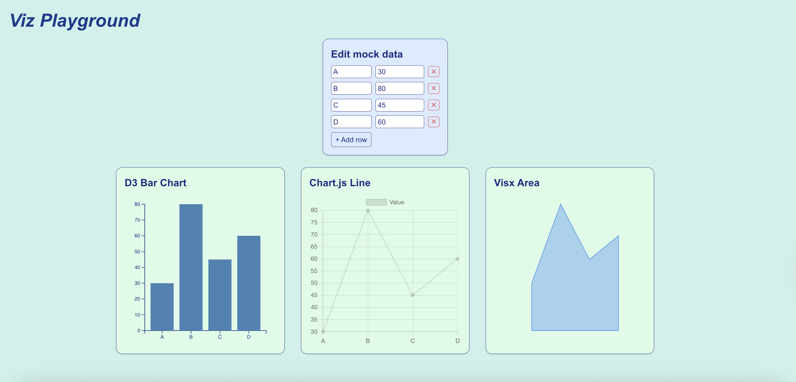

# Viz Playground 🖼️📊

Interactive playground that renders the **same sample data set** with  
- **D3.js** (SVG bar chart)  
- **Chart.js 4** (canvas line chart via `react-chartjs-2`)  
- **Visx** (SVG area chart, semi-transparent)  

…and lets you **edit the data in-browser**. Add or delete rows in the table and watch every chart update in real-time.

---

## ✨ Features
| Feature | Notes |
| ------- | ----- |
| **DataEditor** | Editable table with “＋” to add and “✕” to delete rows |
| **D3 BarChart** | Custom scales, axes, tooltip |
| **ChartJS Line** | Built-in hover legend, smooth line |
| **Visx Area** | Semi-transparent fill (`rgba(59,130,246,0.35)`), animated path |
| **React 18 + Next 14** | Static export (`output: "export"`) |
| **Tailwind + Shadcn** | Only for layout; DataEditor uses plain HTML elements |

---

## 🚀 Quick start

1. Build the project:  
   ```bash
   npm run build
2. Export static files:
   ```bash
    npm run export
3. Serve locally on port 3000:
   ```bash
    npx serve@latest out


Then open http://localhost:3000

